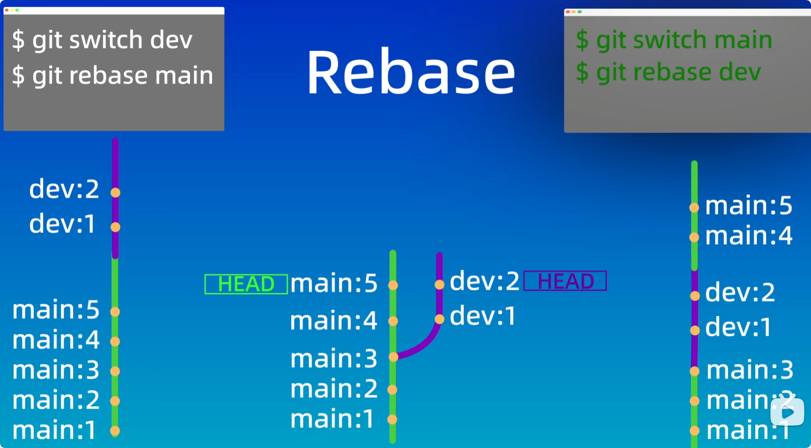

`git ls-files` 查看暂存区的文件

## git reset
`git reset` 三种模式
`git rest HEAD^` 回退到上一个版本
命令               工作区    暂存区
`git reset --soft`    √         √
`git reset --hard`    ×         ×
`git reset --mixed`   √         × 

## git diff
`git diff` 查看文件修改后的差异(一般用图形化界面查看，了解即可) 工作区 暂存区差异
`git diff HEAD` 比较工作区+暂存区和本地仓库差异
`git diff --cached` 比较暂存区和本地仓库差异

## git rm
`git rm` 文件名 从工作区和暂存区同时删除文件

## gitignore
用于忽略某些文件，主要包括
1.系统自动生成
2.编译产生的中间文件，结果文件 java .class
3.运行产生的日志，缓存，临时文件
4.涉及身份，密码，口令文件

## 使用SSH key来clone远程仓库
1.配置ssh key  私钥文件 id_rsa 公钥文件id_rsa.pub

## 本地仓库和远程仓库的同步
`git push` 将本地仓库代码push到远程仓库
`git pull` 将远程仓库代码pull推送到本地仓库
`git fetch` 将远程仓库代码fetch到本地仓库 和pull的区别是， fetch只会获取远程仓库的修改，

如果已经有一个本地仓库，要与远程仓库进行连接同步，步骤如下
1.建立连接 `git remote add origin https://github.com/saohuahua/second-repository.git`
2.设置分支 `git branch -M main` 默认分支是main 可以省略
3.将本地仓库push到远程仓库 `git push -u origin main`

## git分支
`git branch` 查看所有的分支
`git branch 分支名` 添加分支
`git branch -d 分支名` 删除已经完成合并的分支
`git branch -D 分支名` 删除未合并的分支
`git checkout 分支名` 切换分支 但是语义不够明确，他可以用于恢复文件
`git switch 分支名` 来准确切换分支

分支内的代码，文件是彼此独立的，在切换分支之前，确保更改已经提交到暂存区且已提交

如何合并分支？
`git merge 分支名`, 例如在main分支下合并dev分支  `git merge dev`

## 如何处理分支冲突
方法1：在产生冲突的文件中 对如下
` ++<<<<<<< HEAD
++这是main文件，在main分支下开发的！ 在main分支下又添加
++=======
++这是main文件，在main分支下开发的！ 在feat环境在，在其后面进行添加了一行
++>>>>>>> feat ` 
进行合并后可以得到
`这是main文件，在main分支下开发的！ 在main分支下又添加 这是main文件，在main分支下开发的！ 在feat环境在，在其后面进行添加了一行 将两者合并到了一行`

方法2 `rebase` 变基
`git switch dev,git rebase main`
`git switch main,git rebase dev` 

1.找到共同祖先分支，以此来区分两个不同的分支
2.根据`git rebase dev`将main分支移植到dev中的分支上去
